# MindMate - AI-Powered Mental Health & Wellness Platform

<div align="center">


*A comprehensive, real-time AI-powered mental health and wellness platform with voice capabilities, interactive games, and advanced psychological assessments.*

</div>

---

## 📋 Table of Contents

- [Overview](#overview)
- [Features](#features)
- [Technical Stack](#technical-stack)
- [System Architecture](#system-architecture)
- [Prerequisites](#prerequisites)
- [Setup & Installation](#setup--installation)
- [Quick Start](#quick-start)
- [Commands Reference](#commands-reference)
- [Project Structure](#project-structure)
- [License](#license)

---

## 🎯 Overview

**MindMate** is an innovative, enterprise-grade mental health and wellness platform that leverages artificial intelligence to provide accessible, personalized mental health support. Built with Django 5.1, it features real-time voice interactions, AI-driven psychological assessments, and an interactive gaming system designed to promote mental wellness.

The platform combines cutting-edge technologies including:
- **Real-time Communication**: WebSocket-based voice call system powered by Daphne
- **AI Intelligence**: Google Gemini API for conversational AI and Cloudflare AI for advanced processing
- **Voice Integration**: Twilio and ElevenLabs for high-quality voice services
- **Asynchronous Processing**: Celery for background tasks and scheduled jobs
- **Real-time Data**: Redis for caching and session management

---

## ✨ Features

### 🎤 Voice-Based Interactions
- Real-time voice calls with AI assistants
- Twilio-powered WebRTC connectivity
- ElevenLabs text-to-speech for natural conversations
- Multi-language support for voice interactions

### 🤖 AI-Powered Assessments
- Intelligent psychological assessment quizzes
- Google Gemini API-powered question generation
- Personalized mental health scoring
- Comprehensive test result analytics

### 🎮 Interactive Games & Activities
- Cognitive wellness games
- Mood-tracking gamification
- Stress-relief mini-games
- Progress tracking and achievements

### 👥 User Management
- Secure authentication with django-allauth
- User profiles with mental health history
- Privacy-focused data storage
- HIPAA-compliant architecture design

### 📊 Analytics & Reporting
- Comprehensive mental health assessments
- Journal entry management
- Prescription tracking
- Audio duration analytics for voice sessions

### 🔄 Real-time Features
- WebSocket support via Django Channels
- Live chat with AI assistants
- Instant notifications
- Real-time progress updates

---

## 🛠️ Technical Stack

### Backend
- **Framework**: Django 5.1.2
- **Python**: 3.8+
- **Real-time Communication**: Django Channels 4.0.0
- **ASGI Server**: Daphne 4.0.0
- **Task Queue**: Celery 5.3.4 with Redis backend

### Frontend
- **Template Engine**: Django Templates (Jinja2)
- **UI Framework**: Bootstrap 5
- **Real-time Updates**: WebSocket connections
- **JavaScript**: Vanilla JS with WebSocket API

### External Services
- **AI/ML**: Google Generative AI (Gemini)
- **Alternative AI**: Cloudflare AI API
- **Voice**: Twilio 9.0.0 for calling
- **Text-to-Speech**: ElevenLabs 1.0.0
- **Speech-to-Text**: SpeechRecognition library

### Infrastructure
- **Cache/Message Broker**: Redis 5.0.1
- **Database**: SQLite (Development), PostgreSQL (Production)
- **Containerization**: Docker & Docker Compose
- **Tunneling**: ngrok for local development webhooks

### Libraries & Tools
- **Computer Vision**: OpenCV, FaceNet-PyTorch
- **Emotion Detection**: FER (Facial Expression Recognition)
- **Audio Processing**: FFmpeg, moviepy
- **Data Analysis**: Pandas, NumPy
- **Machine Learning**: TensorFlow 2.17.0, PyTorch 2.2.2

---

## 🏗️ System Architecture

```mermaid
graph TD
    User["👤 Users"] <--> UI["🌐 Django Web UI<br/>(Port: 8000)"]
    UI <--> API["🔌 Daphne ASGI Server"]
    
    subgraph Backend["Backend Services"]
        API --> Auth["🔐 Authentication"]
        API --> Core["⚙️ Core Logic Engine"]
        API --> Voice["🎤 Voice Processor"]
    end
    
    subgraph Storage["Storage Layer"]
        Core --> DB[("🗄️ PostgreSQL<br/>User Data")]
        Auth --> Cache[("⚡ Redis<br/>Cache & Broker")]
        Voice --> Media[("📁 Media Storage")]
    end
    
    subgraph External["External Services"]
        Core --> Gemini["🤖 Google Gemini API"]
        Voice --> STT["🎙️ Google Speech-to-Text"]
        Voice --> TTS["🔊 ElevenLabs TTS"]
        Auth --> Twilio["📞 Twilio Voice API"]
    end
    
    Cache --> Tasks["⏱️ Celery Task Queue"]
    Tasks --> Beat["🔄 Celery Beat Scheduler"]
```



---

## 📦 Prerequisites

### System Requirements
- **OS**: Windows 10+, macOS, or Linux
- **Python**: 3.8 or higher
- **Node.js**: 14+ (optional, for frontend tools)
- **Docker**: 20.10+ (for containerized deployment)
- **Git**: Latest version

### Required Software
- PostgreSQL 12+ (for production)
- Redis 6.0+ (for caching and message broker)
- FFmpeg (for audio/video processing)

### API Keys Required
- Google Generative AI API key ([Get here](https://aistudio.google.com/apikey))
- Twilio Account SID & Auth Token ([Get here](https://www.twilio.com/console))
- ElevenLabs API Key ([Get here](https://elevenlabs.io/))
- Cloudflare API Token ([Get here](https://dash.cloudflare.com/))
- ngrok auth token for development ([Get here](https://ngrok.com/))

---

## 🚀 Setup & Installation

### Step 1: Clone the Repository

```bash
git clone https://github.com/yourusername/mindmate.git
cd mindmate
```

### Step 2: Create Python Virtual Environment

**Windows (PowerShell):**
```powershell
python -m venv venv
.\venv\Scripts\Activate.ps1
```

**macOS/Linux:**
```bash
python3 -m venv venv
source venv/bin/activate
```

### Step 3: Install Dependencies

```bash
pip install -r requirements.txt
```

### Step 4: Initialize Database

```bash
python manage.py makemigrations
python manage.py migrate
```

### Step 5: Create Superuser

```bash
python manage.py createsuperuser
```

### Step 6: Collect Static Files

```bash
python manage.py collectstatic --noinput
```

---

## ⚡ Quick Start

### Using PowerShell Scripts (Windows)

**Setup Environment:**
```powershell
.\setup-env.ps1
```

**Setup Voice Calls:**
```powershell
.\setup-voice-calls.ps1
```

**Start the System:**
```powershell
.\docker-quickstart.ps1
```

### Manual Startup (All Platforms)

#### Terminal 1: Start Redis
```bash
docker run -d --name redis -p 6379:6379 redis:latest
```

#### Terminal 2: Start ngrok
```bash
ngrok http 8000
# Copy the https:// URL and update NGROK_URL in .env
```

#### Terminal 3: Start Daphne Server
```bash
# Windows
.\venv\Scripts\Activate.ps1
daphne -b 0.0.0.0 -p 8000 perplex.asgi:application

# macOS/Linux
source venv/bin/activate
daphne -b 0.0.0.0 -p 8000 perplex.asgi:application
```

#### Terminal 4: Start Celery Worker
```bash
# Windows
.\venv\Scripts\Activate.ps1
celery -A perplex worker -l info -P solo

# macOS/Linux
source venv/bin/activate
celery -A perplex worker -l info
```

#### Terminal 5: Start Celery Beat (Scheduler)
```bash
# Windows
.\venv\Scripts\Activate.ps1
celery -A perplex beat -l info

# macOS/Linux
source venv/bin/activate
celery -A perplex beat -l info
```

#### Access the Application
- **Web Application**: http://localhost:8000
- **Django Admin**: http://localhost:8000/admin
- **Default Credentials**: Use the superuser account created in setup

---

## 📚 Commands Reference

For detailed command reference, see [command list.txt](./command%20list.txt)

### Common Commands

**Database Management:**
```bash
# Create migrations
python manage.py makemigrations

# Apply migrations
python manage.py migrate

# Show SQL for migrations
python manage.py sqlmigrate app 0001
```

**Static Files:**
```bash
# Collect static files
python manage.py collectstatic

# Clear static files cache
python manage.py clearcache
```

**Testing:**
```bash
# Run all tests
python manage.py test

# Run specific test module
python manage.py test app.tests

# Run with verbosity
python manage.py test --verbosity=2
```

**Development Server:**
```bash
# Development server (not for production)
python manage.py runserver 0.0.0.0:8000

# Use Daphne for WebSocket support
daphne -b 0.0.0.0 -p 8000 perplex.asgi:application
```

---

## 📁 Project Structure

```
mindmate/
├── accounts/                    # User authentication & profiles
│   ├── migrations/
│   ├── templates/
│   ├── models.py               # User profile models
│   ├── views.py
│   ├── forms.py
│   └── signals.py
│
├── app/                         # Core application
│   ├── migrations/
│   ├── templates/
│   ├── models.py               # Main data models
│   ├── views.py
│   ├── forms.py
│   ├── urls.py
│   └── admin.py
│
├── games/                       # Gamification & wellness games
│   ├── migrations/
│   ├── templates/
│   ├── models.py
│   ├── views.py
│   └── urls.py
│
├── voice_calls/                 # Voice integration module
│   ├── migrations/
│   ├── templates/
│   ├── services/               # Twilio, ElevenLabs services
│   ├── utils/                  # Voice utilities
│   ├── models.py
│   ├── views.py
│   ├── consumers.py            # WebSocket consumers
│   ├── routing.py              # WebSocket routing
│   ├── tasks.py                # Celery tasks
│   └── urls.py
│
├── perplex/                     # Django project settings
│   ├── settings.py             # Main Django settings
│   ├── asgi.py                 # ASGI configuration
│   ├── wsgi.py                 # WSGI configuration
│   ├── urls.py                 # URL routing
│   ├── celery.py               # Celery configuration
│   └── routing.py              # WebSocket routing
│
├── templates/                   # Global templates
│   ├── base.html
│   ├── includes/
│   └── account/
│
├── media/                       # User uploads
│   ├── images/
│   └── prescriptions/
│
├── manage.py                    # Django management script
├── requirements.txt             # Python dependencies
├── docker-compose.yml           # Docker Compose (dev)
├── docker-compose.prod.yml      # Docker Compose (prod)
├── Dockerfile                   # Docker image definition
├── docker-entrypoint.sh         # Docker entry script
├── .env                         # Environment variables
├── .env.example                 # Example env file
├── .gitignore                   # Git ignore rules
├── LICENSE                      # MIT License
└── README.md                    # This file
```

---

## 📝 License

© 2025 Techipedia. All rights reserved.

This project and all its contents are the exclusive property of Techipedia. Unauthorized copying, reproduction, or distribution of this project or any of its components is strictly prohibited without prior written permission from Techipedia.

---

<div align="center">

**Built with ❤️ for mental health and wellness**


</div>
